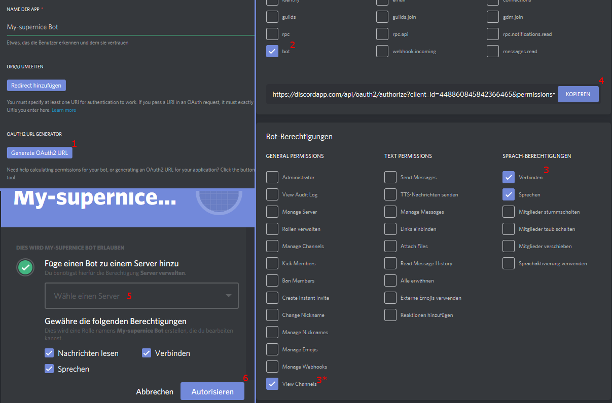
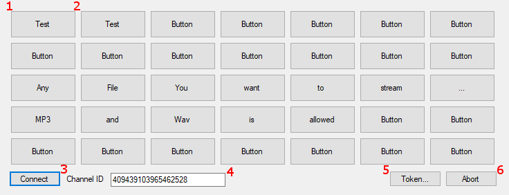
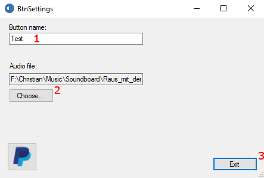
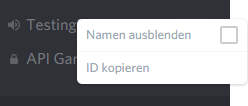

Hi, 
this is my small Discord-Bot, orientated on the Teamspeak Soundboard. <br>

It's main purpose is, to stream your local mp3 and wav files into a discord voice channel, by using a local hosted bot as middleman. <br>
<br>
> ##### You can now stream music, using your client. <br>
> You can uncheck the ```isBot``` box and enter your client token.
> But <b>never ever give away this token</b>.</br>
> With that token you can login as bot and perform any actions in the name of your client + it's not as easy to reset as the token of a bot.
>
> (```TheRacingLion``` described [here](https://github.com/TheRacingLion/Discord-SelfBot/wiki/Discord-Token-Tutorial), how to get this token.) </br>
> <b>Be very carefull with the client token!!</b>
>
> If you decide to use your client account, you can skip the next steps until ```"How to 'install' the Soundboard"```
>
>Considering the limitations (you can't be in a voice channel when streaming music), it is not recommend to use this method.


---

##### What you need:


1. A confirmed Discord Account (one time)
2. Rights to invite a bot to your server (one time)
3. Internet Connection (obviously)
4. Some soundfiles to stream

##### What the bot needs:
1. Rights to join a channel (permanent)
2. Rights to speak in that channel (permanent)
3. One bot per server (multi-broadcasting is not implemented)

---

#### How to create the Bot:

 
1. Create a bot at [this](https://discordapp.com/login?redirect_to=%2Fdevelopers%2Fapplications%2Fme) page

 
2. Create a bot user
  * Make sure to select the tickbox 'OAuth2-Code' needed
  * Copy the user token. You'll need this to use the bot
    * ###### !Anyone with this token, gets full access to the bot, with all it's rights

 
3. Generate a 'OAuth2 URL'
   * Use 'bot' as purpose
   * Select at least the rights to Connect, Speak (and view channels)
     
* Copy the Link and invite the Bot to your server, by opening it.

You might also take a look at [this](https://github.com/reactiflux/discord-irc/wiki/Creating-a-discord-bot-&-getting-a-token) useful instruction

---

#### How to 'install' the Soundboard

In order to use the Soundboard, you need to download some Dll's and put them in the directory of your executable. <br>
All necessary Files are located in the [ReleasedVersions](ReleasedVersions) folder. <br>
You'll find the ```necessaryDlls.zip``` in which all Dll's are saved.

If you compile the project by yourself, the Dll's should get generated.

---

#### How to use the Bot

At first you need to copy all dll's and the .exe.config.
Make sure, that the .exe and the .exe.config are named the same, so the executable can find it. <br>

 


Further you need to connect to the server before playing any file. <br>
> ###### F: Why not connect automatically? <br>
> A: If you want to enter/change the bot token, the bot needs to be disconnected
> Hint: try a right-click
    
> ###### F: Why can't I stream Videos from Youtube? <br>
> A: 1. Downloading videos can be illegal in some cases. Further, the separation of sound and video is not allowed. <br>
>    2. There're plenty of very good music bots out there. There's simply no need, to use your own bandwith to stream a youtube video.

 

1. [Left Click] Start to play the audio file
  * if any file is playing, this will abort the stream
2. [Right Click] Open the setting window for this button
3. Connect to the server
  * right-click for autoconnect
4. Enter the ID<sup>[1](#channelFootnote)</sup> of the channel to join 
5. Abort the current stream

---



1. The Name of the button
2. Opens a file picker, to choose the file
3. Close the winwow
  * you can also 'x' the window away

---


1. Amount of Buttons to display
2. Connect automatically on applacation start
3. Manage channel Favorites (and assign aliases for those long ids)
4. Enter Bot-Token
5. Game-status panel
   * Set a game status on join and leave
   * The Url must be empty or an valid adress, otherwise nothing will happen
   * You can manage presets
   * You can change the status while the bot in connected using the 'Set now' button.


---


1. Show the secret key
2. Enter a new key
  * for entering a new key, the old can stay hidden

> The token is saved into the directory ot the executable <br>
> So you might want to safe if somewhere in your filesystem and link the .exe (e.g. to your Desktop). <br>
> You can also disable the saving of the token and hardcode it into the ```_token``` variable. (You'll need to compile it afterwards)


<br><br><br>

<a name="channelFootnote">1</a>



