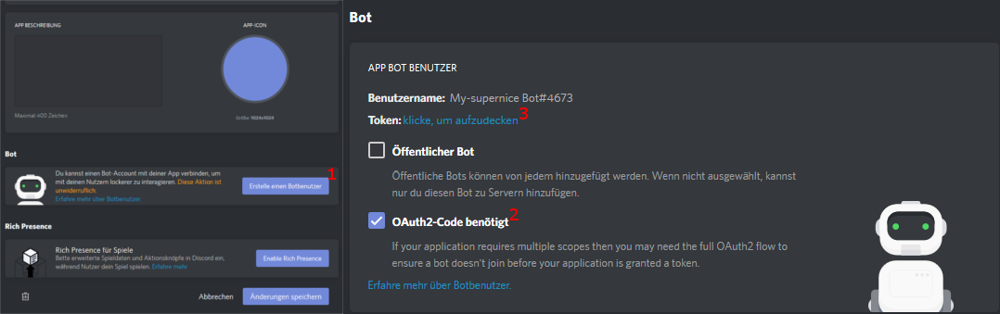

## THIS BRANCH IS UNDER CONSTRUCTION, AND NOT FULLY FUNCTIONAL

Hi, 
this is a small Discord-Soundboard for streaming Sounds/Music into voicechannels.
  
 
In contrast to a Soundbot, this application hosts a bot on your local machine for the duration of the playback.
This brings the advantage of an guaranteed availability of the service, combined with the abillity to stream local files from your Harddrive.

 
---

##### What you need:

1. A confirmed Discord Account (one time)
2. Rights to invite a bot to your server (one time)
3. Internet Connection (obviously)
4. Some soundfiles to stream

##### What the bot needs:
1. Rights to join a channel (permanent)
2. Rights to transmitt audio into that channel (permanent)

---

#### How to create the Bot:

 
1. Create a bot at [this](https://discordapp.com/login?redirect_to=%2Fdevelopers%2Fapplications%2Fme) page

 
2. Create a bot user
  * Make sure to select the tickbox 'OAuth2-Code' needed
  * Copy the user token. You'll need this to use the bot
    * ###### !Anyone with this token, gets full access to the bot, with all it's rights

 
3. Generate a 'OAuth2 URL'
   * Use 'bot' as purpose
   * Select at least the rights to Connect, Speak (and view channels)
     
* Copy the Link and invite the Bot to your server, by opening it.

You might also take a look at [this](https://github.com/reactiflux/discord-irc/wiki/Creating-a-discord-bot-&-getting-a-token) useful instruction

---

#### How to 'install' the Soundboard

We've now got a new installer for this application.

You only need to download and execute the install wizard.
Follow all steps and instruction and everything will be set up correctly.

If you compile the project by yourself, the opus and libsodium dll's won't get generated, so you'll need to download them seperately.

---

#### How to use the Bot

###### In the future, there's an short introduction sequence planned, which explains the following steps on the first programm startup.
 
 

Before you can start to stream a file, you need to specify the token you got when creating the bot.

For this you need to enter the settings Menu and enter the value in the corresponting field

(Later on, there will be an hint, if the application can't find a valid token).

 

On the settings-page, you can set other properties on your desire, e.g. your username, the path to the stored settings, ...

 
 

To start streaming a file, you simply need to edit one button, add your file with the filepicker, or by entering the path.
The next step is pressing the button, and the bot will join your channel (as long as you entered a valid username).

<!--insert image -->

Later on, there will be an option to alternatively choose a channel from a list, in which to bot will connect.
The list will be auto-generated by the bot, so you can simply click at the channel of your choice to let tho bot join.

> ###### F: Why can't I stream Videos from Youtube?  
>    1. Downloading videos can be illegal in some cases. Further, the separation of sound and video is not allowed. (As we know so far)  
>    2. This bot is built to fill the gap for streaming files from your disk. There're plenty of very good music bots out there to play online-videos. So there's no need, to use your own bandwith to stream a youtube video, 
---

   

