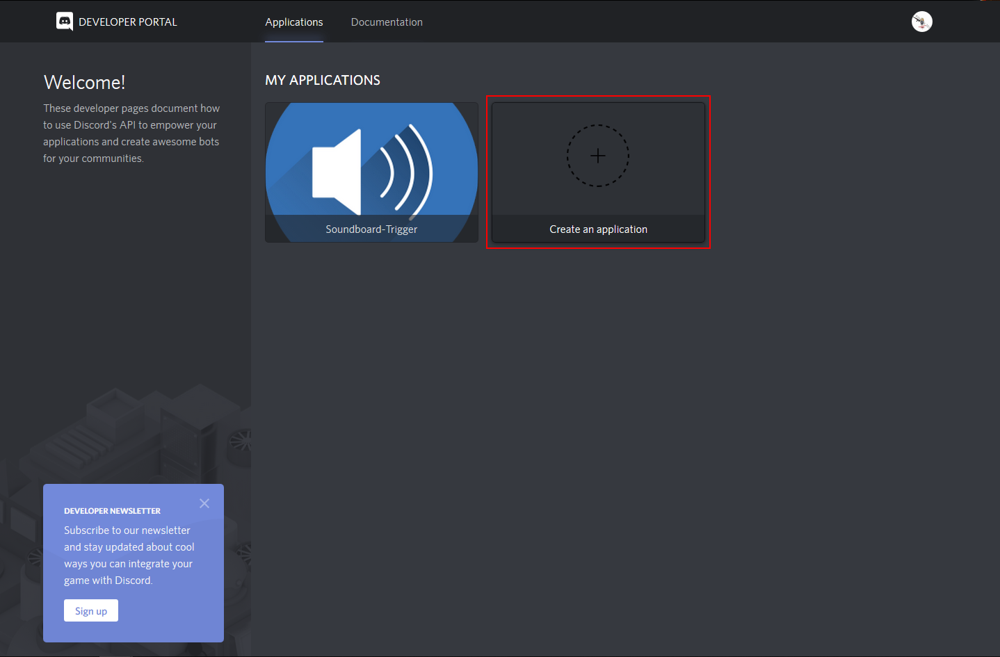
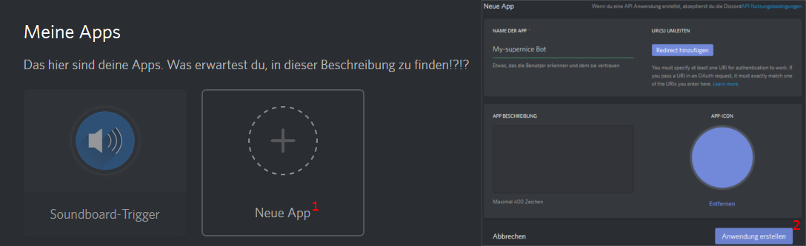
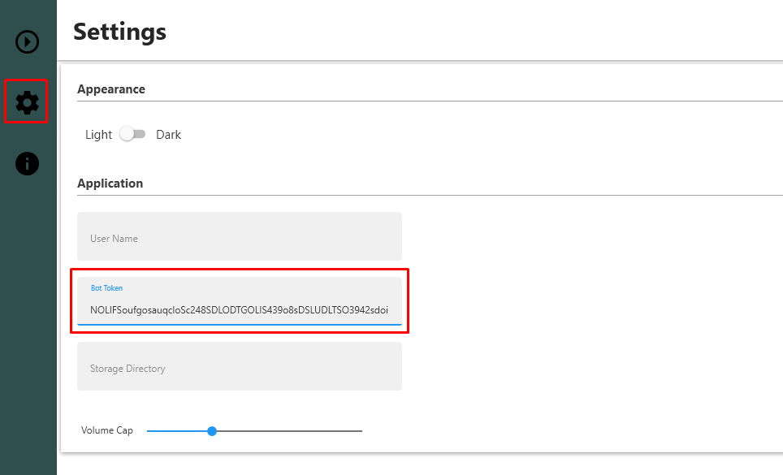

# Welcome to TDS   
## **T**he **D**iscord **S**oundboard 2.X

  

Hi, 
this is a small Discord-Soundboard for streaming Sounds/Music into Discord - voice channels.
 
 
In contrast to a Soundbot, this application hosts a bot on your local machine for the duration of the playback.
This brings the advantage of an guaranteed availability of the service, combined with the abillity to stream local files from your Harddrive.
 

>Developer Information:  
>All source code in the folders 'Bot' and 'Data' is able to run as standalone (per folder).
>The source code in 'Handle' requires both, 'Bot' and 'Data' -source to run unmodified.
>
>For this reason, a code documentation was added for those sectors

---

##### Planned Features (long term):

1. Something similiar to a playlist mode
2. Search mode, wich is providing titles via search on your disk for temporary use
3. Hotkeys to trigger sounds
3. Directly streaming from web plattforms (only if compatible with the law)

---

### Instructions:

##### What you need:
 

1. A confirmed Discord Account (one time)
2. Rights to invite a bot to your server (one time)
3. Internet Connection (obviously)
4. Some soundfiles to stream

 

##### What the bot needs:

1. Rights to join a channel (permanent)
2. Rights to transmit audio into that channel (permanent)
3. Rights to view all channels (comfort feature)
 

---
#### How to create the Bot:

You need to create a bot at [this](https://discordapp.com/login?redirect_to=%2Fdevelopers%2Fapplications%2Fme) page, following the steps below.

1. Create the application
   * Click the button "Create Application"
   * Enter a name and description
   * Save all changes

 
 

 

2. Create a bot user
  * Select the 'bot' tab on the left panel
  * Click the 'add' button
  * Copy the token or remember it for later use
  * Tick the 'Requires OAuth2 code' checkbox
  * Save those changes
  
 
 

3. Generate a 'OAuth2 URL'
   * Select the 'OAuth2' tab on the left panel
   * Tick the 'bot' checkbox in the scope fields
   * Select at least 'View Channels', 'Connect' and 'Speak' in the upcomming permissions field
   * Open the URL inbetween the to fields, to invite the bot
   
 
 

     
4. Invite it
   * Select the Server to join
   * Authorize the bot
   
 

You might also take a look at [this](https://github.com/reactiflux/discord-irc/wiki/Creating-a-discord-bot-&-getting-a-token) useful instruction

---

#### How to 'install' the Soundboard

We've now got a new installer for this application.

You only need to download and execute the install wizard.
Follow all steps and instruction and everything will be set up correctly.

If you compile the project by yourself, the opus and libsodium dll's won't get generated, so you'll need to download them seperately.

---

#### How to use the Bot

>#### In the future, there's an short introduction sequence planned, which explains the following steps on the first programm startup.
 

Before you can start to stream a file, you need to specify the token, gathered in step 2 when creating the bot.

For this you need to enter the settings Menu and enter the value in the corresponding field

 

On the settings-page, you can set other properties on your desire, e.g. your username for auto-join, the path to the stored settings, ...

 
 

To start streaming a file, you simply need to edit one button, add your file with the filepicker, or by entering the path.
The next step is pressing the button, and the bot will join your channel (as long as you entered a valid username).

<!--insert image -->

---

> ###### F: Why can't I stream Videos from Youtube?  
>    1. Downloading videos can be illegal in some cases. Further, the separation of sound and video is not allowed. (As we know so far)  
>    2. This bot is built to fill the gap for streaming files from your disk. There're plenty of very good music bots out there to play online-videos. So there's no need, to use your own bandwith to stream a youtube video.  
>     
>    But let's see what the future brings

