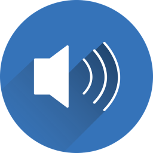

# Welcome to TDS   
## **T**he **D**iscord **S**oundboard 2.X

  

Hi, 
this is a small Discord-Soundboard for streaming Sounds/Music into Discord - voice channels.
 
 
In contrast to a 'normal' Soundbot, this application hosts a bot on your local machine for the duration of the playback.
This brings the advantage of an guaranteed availability of the service, combined with the abillity to stream local files from your Harddrive.
 

>Developer Information:  
>All source code in the folders 'Bot' and 'Data' is able to run as standalone (per folder).
>The source code in 'Handle' requires both, 'Bot' and 'Data' -source to run unmodified.
>
>For this reason, a code documentation was added for those sectors

---

##### Planned Features (long term):

1. Search mode, wich is providing titles via search on your disk for temporary use
2. Something similiar to a playlist mode
3. Hotkeys to trigger sounds
3. Directly streaming from web plattforms (only if compatible with the law)

---

### Instructions:

##### What you need:
 

1. A confirmed Discord Account (one time)
2. Rights to invite a bot to your server (one time)
3. Internet Connection (obviously)
4. Administrator rights (only if using installer, one time)
4. Some soundfiles to stream

 

##### What the bot needs:

1. Rights to join a channel (permanent)
2. Rights to transmit audio into that channel (permanent)
3. Rights to view all channels (provides more features)
 

---
#### How to create the Bot:

If you don't already know the procedure, check out [this](https://github.com/Mayerch1/TheDiscordSoundboard/wiki/Configure-The-Bot) instruction in the wiki ([wiki/Configure-The-Bot.md](https://github.com/Mayerch1/TheDiscordSoundboard/wiki/Configure-The-Bot))

---

#### How to 'install' the Soundboard

We've now got a new installer for this application.

You only need to [download](https://github.com/Mayerch1/TheDiscordSoundboard/releases/latest) and execute the install wizard.
Follow all steps and instruction and everything will be set up correctly.

If you compile the project by yourself, the opus and libsodium dll's won't get generated, so you'll need to download them seperately.

---

#### How to use the Bot

>##### In the future, there's maybe coming an introduction sequence, which explains all important steps on the first programm startup.
 

To see, how to set up the application on it's first startup, have a look at [this](https://github.com/Mayerch1/TheDiscordSoundboard/wiki/First-Startup) wiki page ([wiki/First-Startup](https://github.com/Mayerch1/TheDiscordSoundboard/wiki/First-Startup)).

---

> ###### F: Why can't I stream Videos from Youtube?  
>    1. Downloading videos can be illegal in some cases. Further, the separation of sound and video is not allowed. (As we know so far)  
>    2. This bot is built to fill the gap for streaming files from your disk. There're plenty of very good music bots out there to play online-videos. So there's no need, to use your own bandwith to stream a youtube video.  
>     
>    But let's see what the future brings

