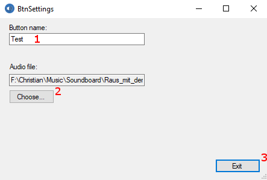
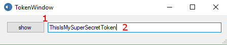

Hi, 
this is my small Discord-Bot, orientated on the Teamspeak Soundboard. <br>

It's main purpose is, to stream your local mp3 and wav files into a discord voice channel, by using a local hosted bot as middleman. <br>
<br>


---

##### What you need:
1. A confirmed Discord Account (one time)
2. Rights to invite a bot to your server (one time)
3. Internet Connection (permanent)
4. Some soundfiles to stream

What the bot needs:
1. Rights to join a channel (permanent)
2. Rights to speak in that channet (permanent)
3. One bot per server (multi-broadcasting is not implemented)


##### How to create the Bot:

1. Create a bot at [this](https://discordapp.com/login?redirect_to=%2Fdevelopers%2Fapplications%2Fme) page

2. Create a bot user
  * Make sure to select the tickbox 'OAuth2-Code' needed
  * Copy the user token. You'll need this to use the bot
    * ###### !Anyone with this token, gets full access to the bot with all it's rights

3. Generate a 'OAuth2 URl'
   * Use 'bot' as purpose
   * Select at least the rights to Connect, Speak (and view channels)
     
3. Copy the Link and invite the Bot to your server, by clicking it.

You might also take a look at [this](https://github.com/reactiflux/discord-irc/wiki/Creating-a-discord-bot-&-getting-a-token) useful instruction

---

#### How to use the Bot

You need to connect to the server before playing any file. <br>
> Why not connect automitically? <br>
> If you want to enter/change the bot token, the bot needs to be disconnected
    


1. [Left Click] Start to play the audio file
  *if any file is playing, this will abort the stream
2. [Right Click] Open the setting window for this button
3. Connect to the server
4. Enter the ID of the channel to join
5. Enter the Bot-Token
6. Abort the current stream

---



1. The Name of the button
2. Opens a file picker, to choose the file
3. Close the winwow
  *you can also 'x' the window away

---



1. Show the secret key
2. Enter a new key
  *for enering a new key, the old can stay hidden

> The token is saved into the directory ot the executable <br>
> So you might want to safe if somewhere in your filesystem and link the .exe (to e.g. your Desktop). <br>
> You can also disable the saving of the token and hardcode it into the ```_token``` variable. (You'll need to compile it afterwards)


