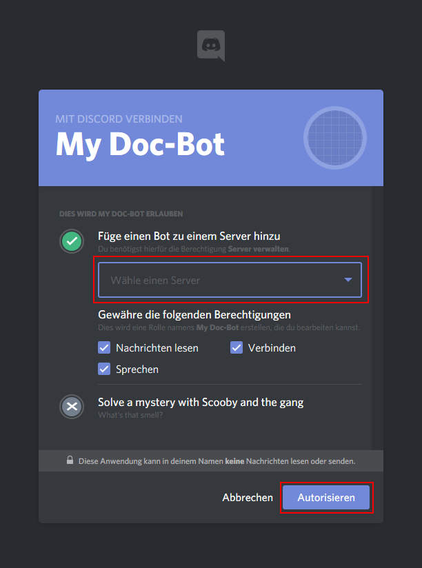

### How to create a Discord Bot

---

You need to create a bot at [this](https://discordapp.com/login?redirect_to=%2Fdevelopers%2Fapplications%2Fme) page, following the steps below.

1. Create the application
   * Click the button "Create Application"
   * Enter a name and description
   * Save all changes

 
 

 

2. Create a bot user
  * Select the 'bot' tab on the left panel
  * Click the 'add' button
  * Copy the token or remember it for later use
  * Tick the 'Requires OAuth2 code' checkbox
  * Save those changes
  
 
 

3. Generate a 'OAuth2 URL'
   * Select the 'OAuth2' tab on the left panel
   * Tick the 'bot' checkbox in the scope fields
   * Select at least 'View Channels', 'Connect' and 'Speak' in the upcomming permissions field
   * Open the URL inbetween the to fields, to invite the bot
   
 
 

     
4. Invite it
   * Select the Server to join
   * Authorize the bot
   
 

You might also take a look at [this](https://github.com/reactiflux/discord-irc/wiki/Creating-a-discord-bot-&-getting-a-token) useful instruction
